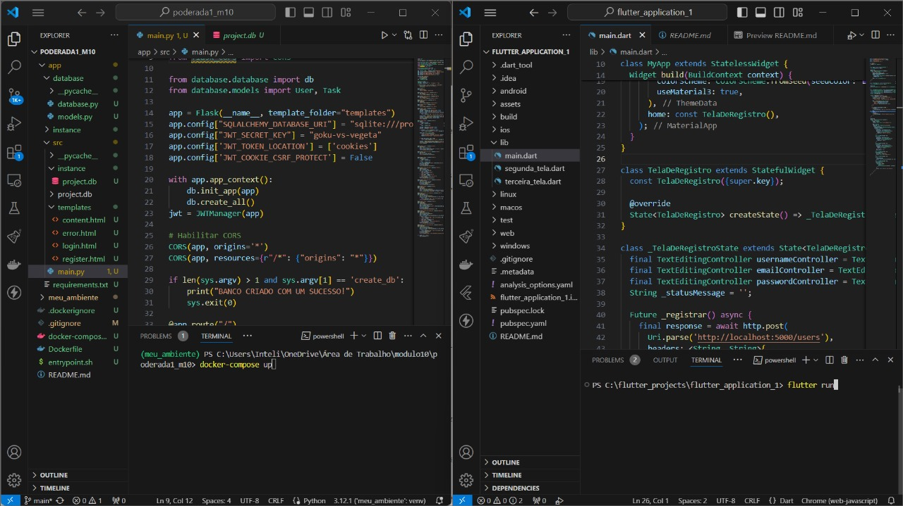
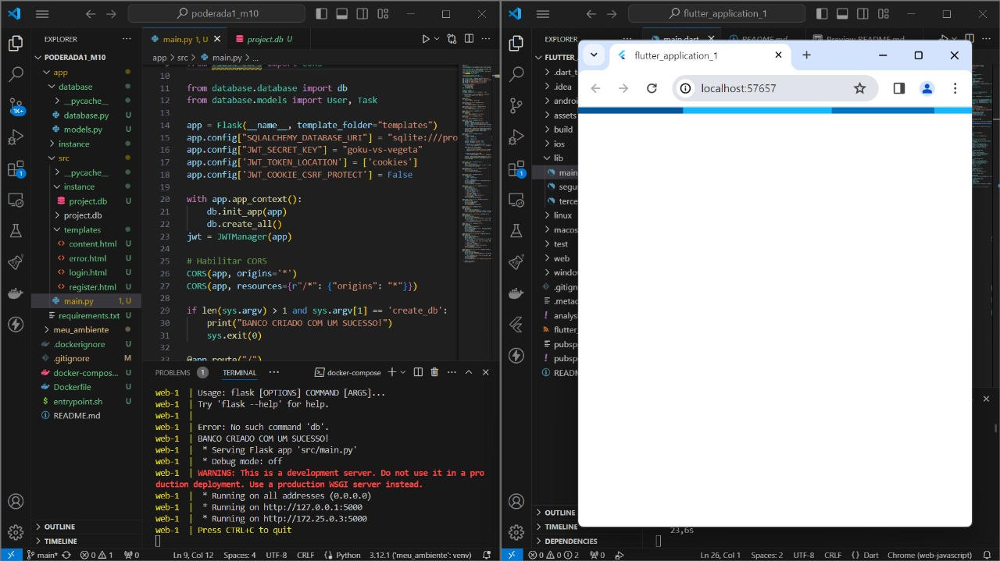
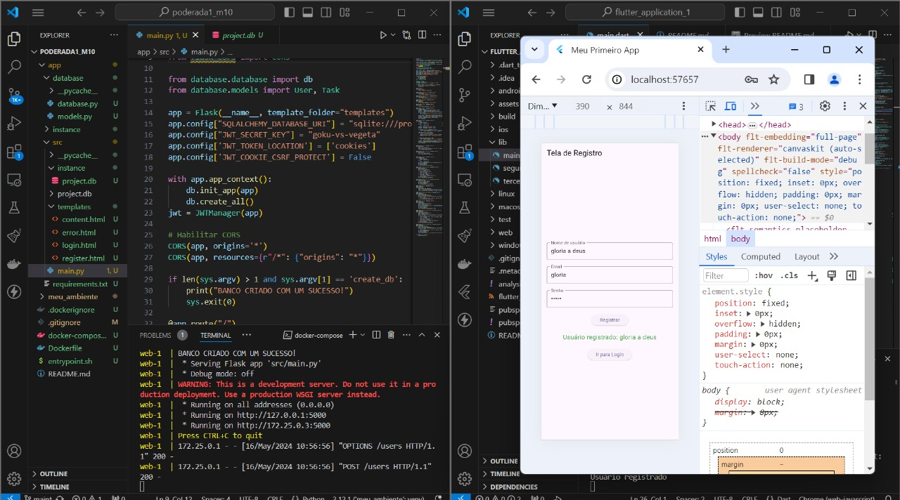
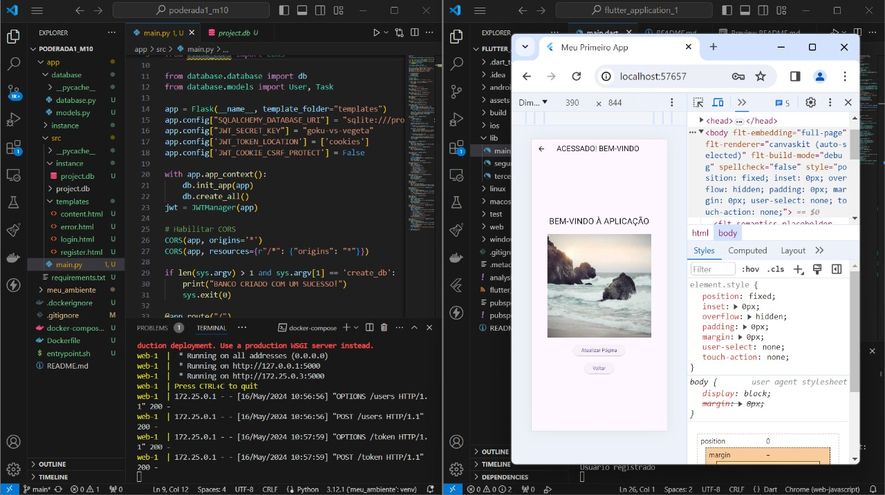
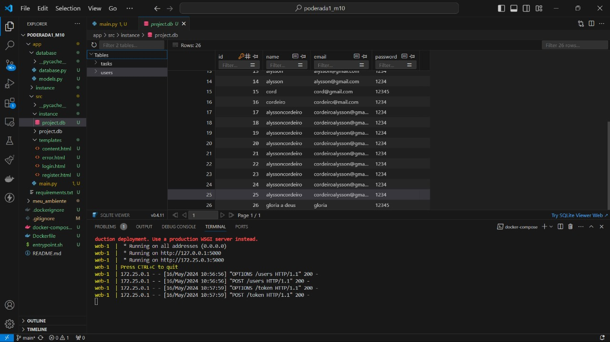

# Projeto de Integração Flutter e Flask

PONDERADA 3

###### ALYSSON C. C. CORDEIRO - ENGENHARIA DA COMPUTAÇÃO - INTELI

## Objetivo

O objetivo deste projeto é integrar uma aplicação Flutter com um backend Flask rodando em Docker. O projeto consiste em três telas no Flutter: uma tela de registro, uma tela de login e uma tela de conteúdo que é acessada após um login bem-sucedido.

## Estrutura do Projeto

```python
flutter_application_1/
├── android/
├── build/
├── ios/
├── lib/
│   ├── main.dart
│   ├── segunda_tela.dart
│   ├── terceira_tela.dart
├── assets/
│   ├── cao.jpg
├── test/
├── pubspec.yaml
├── Dockerfile
├── docker-compose.yml
├── app/
│   ├── database/
│   │   ├── database.py
│   │   ├── models.py
│   ├── src/
│   │   ├── templates/
│   │   │   ├── login.html
│   │   │   ├── register.html
│   │   │   ├── content.html
│   │   │   └── error.html
│   │   ├── main.py
│   │   └── instance/
│   │       └── project.db
│   ├── requirements.txt
│   ├── entrypoint.sh

```

## Pré-requisitos:

- Docker e Docker Compose instalados
- Flutter SDK instalado

## Importante:
 
Vale lembrar que são 3 telas no Flutter, uma no de registro, outra de login, e uma que abre o login e diz "BEM-VINDO"

## Instruções para rodar

1. BACKEND (FLASCK) COM DOCKER

- Clone o repositório:

```python

git clone https://github.com/alyssoncastro/ponderada3_m10.git
cd ponderada3_m10/flutter_aplication_1

```
- Inicie o Docker em terminal:

```python
docker-compose build
```

```python
docker-compose up
```

Isso irá construir as imagens Docker e iniciar os contêineres definidos no arquivo `docker-compose.yml`.

- Verifique se o backend está rodando:

Abra o navegador e acesse http://localhost:5000/users. Deve retornar uma resposta da API.

2. FRONTEND (FLUTTER)

Em outro terminal:

- Navegue até o diretório do projeto Flutter:

```python
cd flutter_application_1
```

- Instale as dependências:

```python
flutter pub get
```

- Atualize o código Flutter com o endereço IP correto:

No arquivo main.dart e segunda_tela.dart, substitua 'http://<seu-endereco-ip>:5000' pelo endereço IP da sua máquina.

- Execute o Flutter:

```python
flutter run
```

OBS: vale lembrar que foi feito em dois caminhos diretórios, mas pode usar a mesma estrutura de pasta que coloquei no inicio. Além disso, foi usado de inicio o emulador do Adnroid Studio contudo para mais rapida perfomance, foi feito com "Chrome (web-javascritp)"


## TELAS DO PROJETOS:

Aqui estão as telas do projeto com flutter respectivamente como fui dito nas instruções como rodar:












## Vídeo:

https://drive.google.com/file/d/1o-gdtyFMr5pr6i_10RTg3hlOxo-mhR3m/view?usp=drive_link
